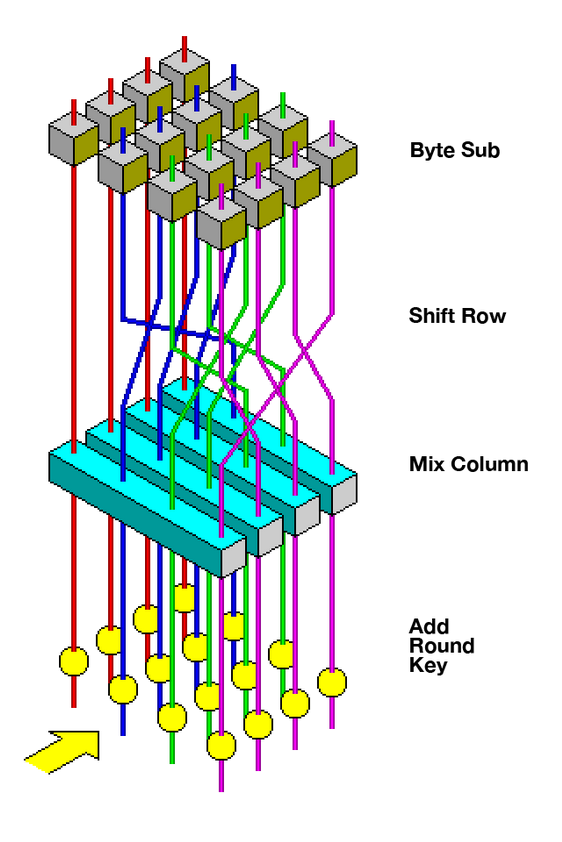
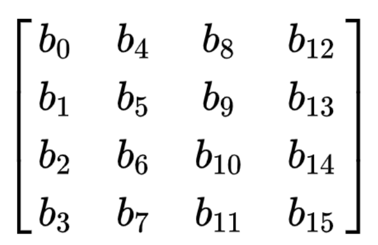
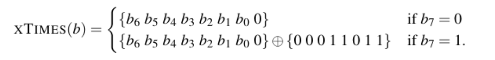

# This document is required.
## Introduction
AES (Advanced Encryption Standard) is the most secure encryption algorithm available today! We implemented AES-256 encryption and decryption.
### Brief history
- In the late 1990s, the National Institute of Standards and Technology (NIST) decided that a new encryption algorithm for U.S. government and commercial data was necessary.
- Previously used Data Encryption Standard (DES), which was now considered insecure because of its relatively short 56-bit key length.
- Formed the AES Selection Team so that the cryptographic community could be involved in the development of the new encryption standard.
- Two Belgian cryptographers, Joan Daemen and Vincent Rijmen submitted a proposal of the Rijndael block cipher during the selection process

- On October 2, 2000, NIST announced the selection of Rijndael and produced a paper summarizing the entire AES selection process.
- On December 6, 2001, NIST announced the approval of the AES as Federal Information Processing Standard (FIPS) 197 in the Federal Register.
- AES became effective as a U.S. federal government standard on May 26, 2002.
### Current use cases
- U.S. government entities such as the NSA and the military use AES encryption for secure communication and storage of data.
- Banks use AES to protect digital files and transactions.
- Solid state drives (SSDs) use AES to protect data at rest.
- All data stored in the Google Cloud is encrypted with AES by default.
- AWS, Oracle, and IBM
- WhatsApp messages

### Background/Definitions
- Operates on a $4\times 4$ column-major order matrix of 16 bytes called the state

- A word is an array of four bytes, often a row or column.
- Key size specifies number of rounds:
  - 10 rounds for 128-bit keys
  - 12 rounds for 192-bit keys
  - 14 rounds for 256-bit keys
  Longer key length makes AES-256 more secure because it is more resistant to brute force attacks!
- For some of the transformations, each of the bytes in the state is considered to be one of the 256 elements of a Galois Field, denoted $GF(2^8)$.
  - Addition: modulo 2 (XOR)
  - Multiplication: first consider multiplying by 2
  
  - To multiply by greater elements, express them in binary, repeatedly use xTimes, and XOR the results

### Structure of the algorithm
A basic, simplified overview of the encryption and decryption algorithms is as follows:
#### Encryption
1. KeyExpansion()
2. Cipher()
   - SubBytes()
   - ShiftRows()
   - MixColumns()
   - AddRoundKey()

#### Decryption
1. KeyExpansion()
2. InvCipher()
   - InvShiftRows()
   - InvSubBytes()
   - AddRoundKey()
   - InvMixColumns()

Symmetric key cipher: the same key is used for both encrypting and decrypting the data

## Explanation of the algorithms
### SubBytes()
- `SubBytes()` is the process of substituting each byte in the state with its corresponding replacement byte in the S-Box.
- Derived from the multiplicative inverse over $GF(2^8)$ combined with an invertible affine transformation
- Good non-linearity properties
- No fixed points (derangement)
- No opposite fixed points
- Replace each byte in the state with its entry in the lookup table
- Inverse: use `indexOf()` to find the byte corresponding to the entry in the lookup table

### ShiftRows()

### MixColumns()
- The four bytes of each column of the state are combined using an invertible linear transformation, helping to provide diffusion
- Specifically, each column is multiplied by a fixed matrix
[insert image]
- Inverse: multiply by the inverse of the fixed matrix
[insert image]

### KeyExpansion()

### AddRoundKey()

### Cipher()