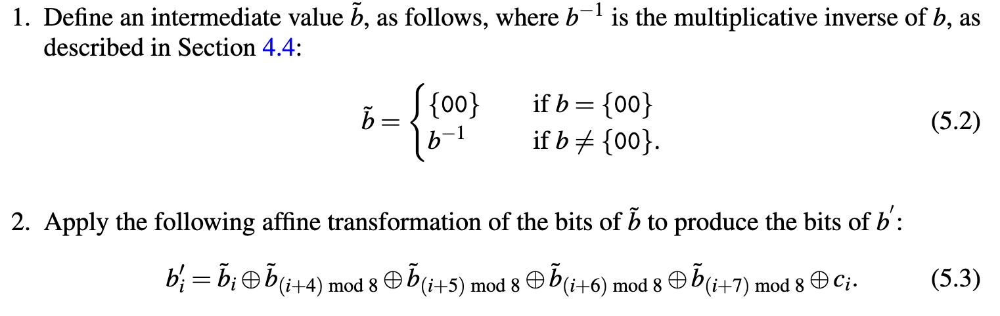
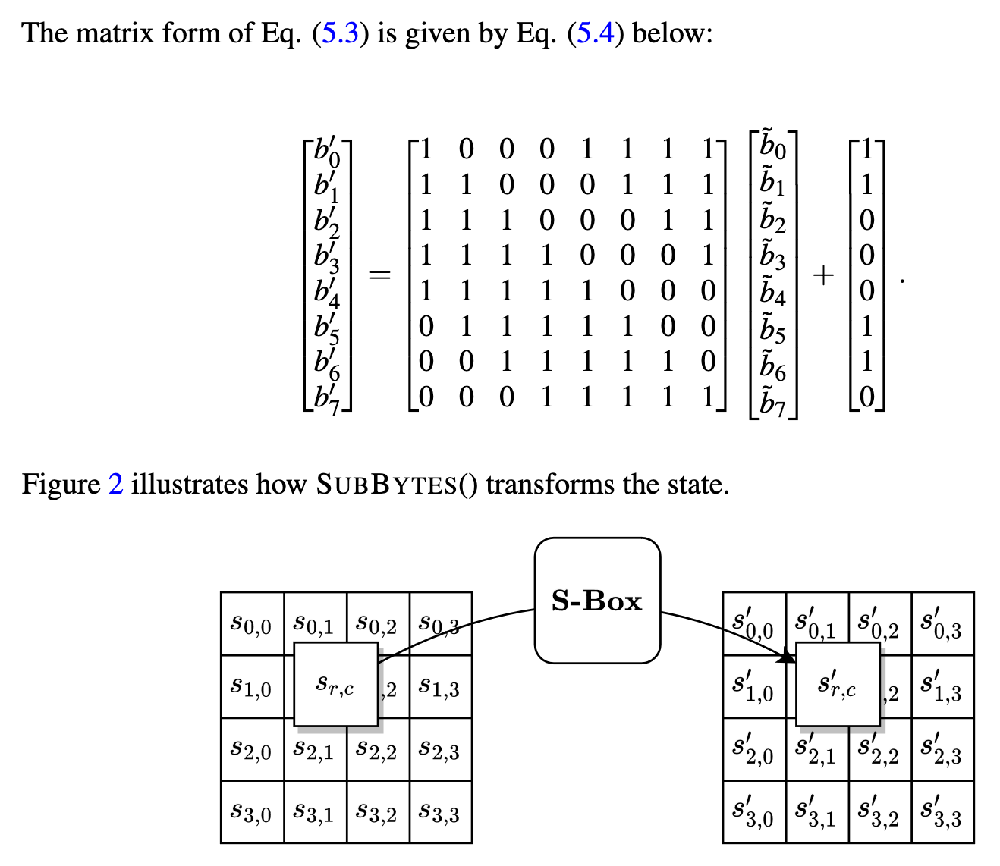
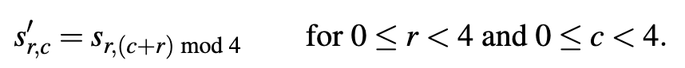
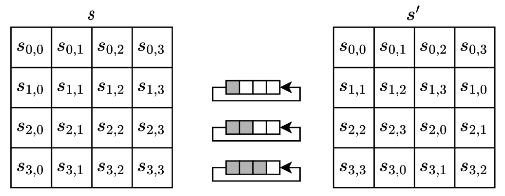
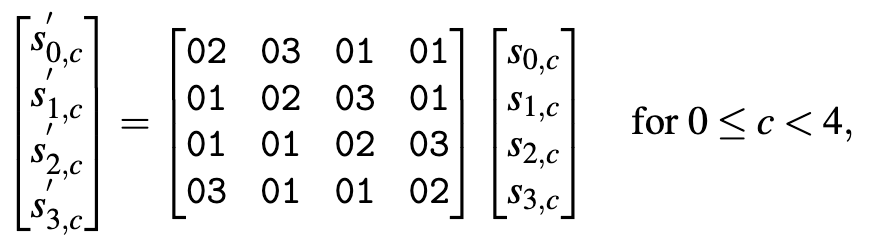
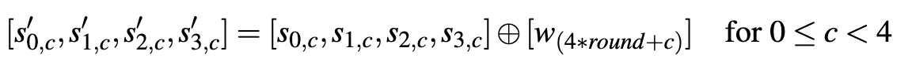
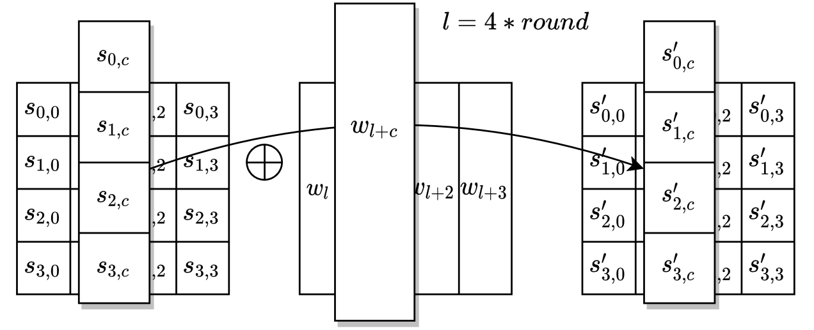
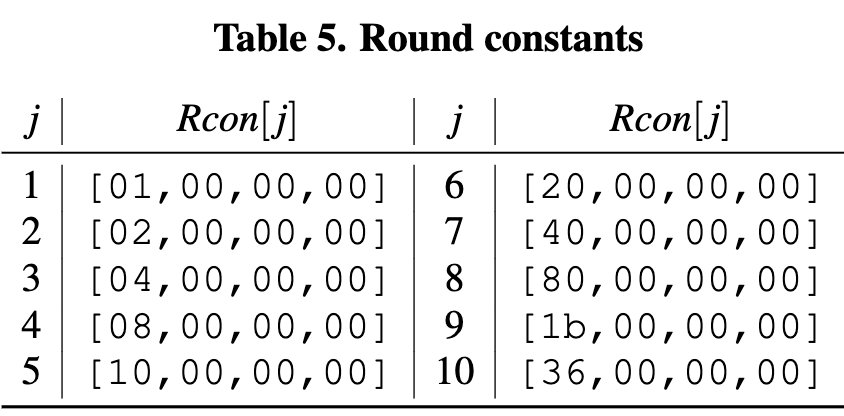
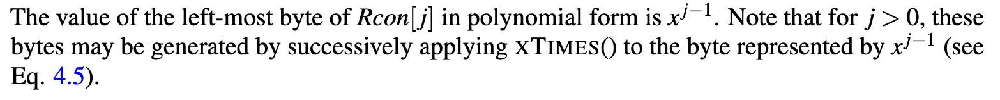
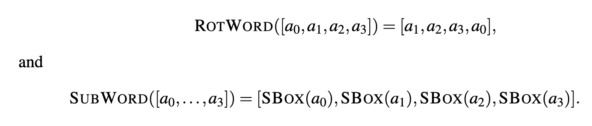

# Preliminary Understanding

### IO and Bits

The input and output are blocks: a sequence of 128 bits
A key is used as an input as well : 256 bits long for AES 256

if we have 128 bits,

Block: r_0, r_1, r_2 ... r_127

or 

Block: a_0, a_1, ... a_15

where a = 8 bytes = 1 byte

### The State

In the state array, denoted by s, each individual byte has two indices: a row index r in the range 0 ≤ r < 4 and a column index c in the range 0 ≤ c < 4.

An individual byte of the state is denoted by either s_r,c or s[r, c].

Input, State, and Output arrays are 4 by 4

### Array of Words

A word is a sequence of four bytes; a block consists of four words. (NO CONNECTION TO ENGLISH, they are just redefining "word")

The four columns of the state array are each a word.

s[r,c] btw

v1 = 
s0,0
s1,0
s2,0
s3,0

v2 = 
s0,1
s1,1
s2,1
s3,1

v3 = 
s0,2
s1,2
s2,2
s3,2

v4 = 
s0,3
s1,3
s2,3
s3,3

# Mathematical Preliminaries

## Galois Field

## Addition 

## Multiplication

# The Algorithm

Cipher()
InvCipher()

Round - Sequence of transformations, each round requiring a round key
Round key - a block represented as four words (16 bytes)

KeyExpansion()

Takes the block cipher as an input and generates the round keys as output.

Input: Array of words, denoted by _key_
Output: expanded array of words, denoted by _w_, called the _key schedule_

The block ciphers AES-128, AES-192, and AES-256 differ in three respects: 

1) The length of the key
2) The number of rounds, which determines the size of the required key schedule
3) The specifcation of the recursion within KeyExpansion()

For each algorithm, the number of rounds is denoted by Nr, and the number of words of the key is denoted by _Nk_.

The three inputs to Cipher() are: 

1) the data input _in_, which is a block represented as a lineararray of 16 bytes
2) the number of rounds _Nr_ for the instance
3) the round keys

## Cipher()

The rounds are composed of these four transformations:

- SubBytes()
- ShiftRows()
- MixColumns()
- AddRoundKey()

The round keys for AddRoundKey() are generated by KeyExpansion().
The key schedule is represented as an array w of 4 ∗ (Nr + 1) words.

.png)

### SubBytes()

SubBytes() is an invertible, non-linear transformation of the state in which a substitution table, called an S-box, is applied independently to each byte in the state.

SBox() -> The AES S-Box

b = input byte of SBox()
c = constant byte {01100011}

b' = output of SBox(b)

SBox uses two transformations:

Basically SBox transforms each byte individually.

### ShiftRows()

ShiftRows() is a transformation of the state in which the bytes in the last three rows of the state are cyclically shifted. 

The number of positions by which the bytes are shifted depends on the row
index _r_.

Moves each byte to the left in the row, cycling the left most byte to the right end of the row. A shift of four is the same as no shift.

The first row, r = 0, is unchanged.

### MixColumns()

MixColumns() multiplies each of the four columns of the state by a fixed matrix.

Fixed Matrix = [a0, a1, a2, a3] = [{02}, {01}, {01}, {03}]. 

### AddRoundKey()

AddRoundKey() is a transformation of the state in which a round key is combined with the state by applying the bitwise XOR operation.

Each round key consists of four words from the key schedule, each of which is combined with a column of the state.

_Round_ is a value in the range 0 ≤ _round_ ≤ _Nr_, and _w_[_i_] is the array of key schedule words.

In Cipher(), AddRoundKey() is invoked Nr + 1 times; Once before the first use of round, and once within each of the _Nr_ rounds, when 1 ≤ round ≤ Nr.

## KeyExpansion()

KeyExpansion() is a routine that is applied to the key to generate 4 ∗ (_Nr_ + 1) words. Thus, four words are generated for each of the _Nr_ + 1 applications of AddRoundKey().

The output of the routine consists of a linear array of words, denoted by _w_[_i_], where _i_ is in the range 0 ≤ _i_ < 4 ∗ (_Nr_ + 1).

It invokes 10 fixed words, denoted by _Rcon_[_j_] (_Round Constants_)

For AES-128, a distinct round constant is called in the generation of each of the 10 round keys. For AES-192 and AES-256, the key expansion routine calls the frst eight and seven of these same constants, respectively.

NOTE: xTimes has something to do with Galois Field multiplication

Two Transformations on Words are called:

- RotWord()
- SubWord()

The first _Nk_ words of the expanded key are the key itself. Every subsequent word _w_[_i_] is generated recursively from the preceding word, _w_[_i_ − 1], and the word Nk positions earlier, _w_[_i_ − _Nk_], as follows:

- If _i_ is a multiple of _Nk_, then _w_[_i_] = _w_[_i_ − _Nk_] ⊕ _SubWord_(_RotWord_(_w_[_i_ − 1])) ⊕ _Rcon_[_i_/_Nk_].
- For AES-256, if _i_ + 4 is a multiple of 8, then _w_[_i_] = _w_[_i_ − _Nk_] ⊕ _SubWord_(_w_[_i_ − 1]).
- For all other cases, _w_[_i_] = w[i − _Nk_] ⊕ _w_[_i_ − 1].

## InvCipher()

InvSubBytes()
InvShiftRows()
InvMixColumns()
AddRoundKey()

### InvShiftRows()

### InvSubBytes()

InvSBox()

### InvMixColumns()

### AddRoundKey()

AddRoundKey() is its own inverse.

## EqInvCipher()

Equivalent Inverse Cipher is apparently more efficient than just Inverse Cipher.
Idk the difference yet.

KeyExpansionEIC()

# Implementation Considerations

AES supports key size 128, 192, and 256
NK = 4, 6, 8 respectively

No keying restrictions when the key is generated appropriately.

Future revisions could include more flexibility with the allowed values for key length, block size, and number of rounds.

(Some more stuff, 6.4 and 6.5)